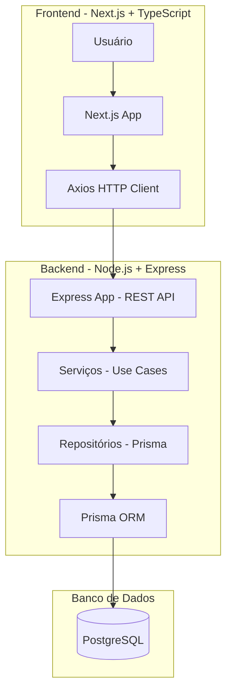

# Projeto Arquitetural

Documento construído a partido do **Modelo BSI - Doc 005 - Documento de Projeto Arquitetual do Software** que pode ser encontrado no
link:[Projeto Arquitetural](https://docs.google.com/document/d/1i80vPaInPi5lSpI7rk4QExnO86iEmrsHBfmYRy6RDSM/edit?usp=sharing)

## Descrição

O projeto seguirá o padrão de arquitetura cliente-servidor, utilizando REST api.

## Mecanismos

| Mecanismo de Análise | Mecanismo de Design       | Mecanismo de Implementação      |
| -------------------- | ------------------------- | ------------------------------- |
| Persistência         | Banco de dados relacional | PostgreSQL                      |
| Camada de Dados      | Mapeamento OR             | Prisma ORM                      |
| Frontend             | Interface Usuário         | Next.js, Typescript, CSS        |
| Backend              | REST                      | Node.js, Express.js, Typescript |
| Build                | Imagem Docker             | Docker e Dockerfile             |
| Deploy               | Container Docker          | Docker compose                  |

## Representação dos Mecanismos

