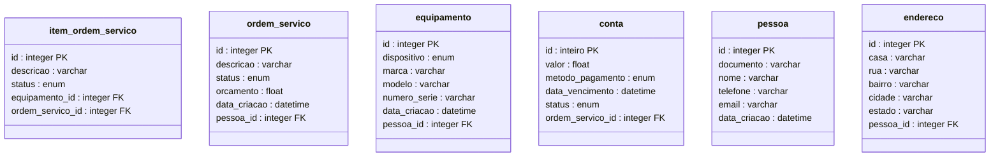
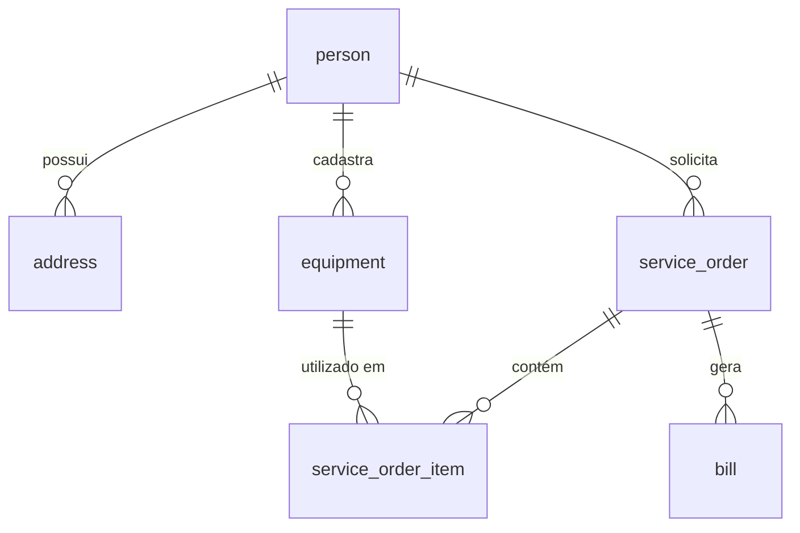

# Documento de Modelos

## Modelo Conceitual

### Diagrama de Classes

## Modelo de Dados (Entidade-Relacionamento)

# Dicionário de Dados - Sistema de Assistência Técnica

# Dicionário de Dados

## Tabela: Pessoa

| Campo        | Tipo     | Tamanho | Obrigatório? | Descrição           | Exemplo            |
| ------------ | -------- | ------- | ------------ | ------------------- | ------------------ |
| id           | SERIAL   | -       | PK           | ID único            | 1                  |
| documento    | VARCHAR  | 20      | Não          | CPF/CNPJ            | "123.456.789-09"   |
| nome         | VARCHAR  | 100     | Sim          | Nome completo       | "João da Silva"    |
| telefone     | VARCHAR  | 20      | Não          | Telefone de contato | "(11) 98765-4321"  |
| email        | VARCHAR  | 100     | Não          | E-mail válido       | "joao@email.com"   |
| data_criacao | DATETIME | -       | Sim          | Data de cadastro    | "2024-01-15 10:30" |

---

## Tabela: Endereço

| Campo       | Tipo    | Tamanho | Obrigatório? | Descrição                             | Exemplo          |
| ----------- | ------- | ------- | ------------ | ------------------------------------- | ---------------- |
| id          | SERIAL  | -       | PK           | ID único                              | 1                |
| complemento | VARCHAR | 30      | Não          | Caso precise informar algo pertinente | "AP 312"         |
| numero      | VARCHAR | 10      | Sim          | Número da casa, prédio ou condomínio  | "123A"           |
| rua         | VARCHAR | 100     | Sim          | Nome da rua                           | "Rua das Flores" |
| bairro      | VARCHAR | 50      | Sim          | Bairro                                | "Centro"         |
| cidade      | VARCHAR | 50      | Sim          | Cidade                                | "São Paulo"      |
| estado      | VARCHAR | 2       | Sim          | UF (sigla)                            | "SP"             |
| pessoa_id   | INTEGER | -       | FK           | ID da pessoa associada                | 1                |

---

## Tabela: Equipamento

| Campo        | Tipo     | Tamanho | Obrigatório? | Descrição             | Exemplo            |
| ------------ | -------- | ------- | ------------ | --------------------- | ------------------ |
| id           | SERIAL   | -       | PK           | ID único              | 1                  |
| dispositivo  | ENUM     | -       | Sim          | Tipo de dispositivo   | "Notebook"         |
| marca        | VARCHAR  | 50      | Sim          | Fabricante            | "Dell"             |
| modelo       | VARCHAR  | 50      | Sim          | Modelo específico     | "Inspiron 15"      |
| numero_serie | VARCHAR  | 50      | Sim          | Número de série único | "DEL123XYZ"        |
| data_criacao | DATETIME | -       | Sim          | Data de cadastro      | "2025-03-20 11:00" |
| pessoa_id    | INTEGER  | -       | FK           | ID do proprietário    | 1                  |

---

## Tabela: Ordem_Servico

| Campo        | Tipo     | Tamanho | Obrigatório? | Descrição            | Exemplo            |
| ------------ | -------- | ------- | ------------ | -------------------- | ------------------ |
| id           | SERIAL   | -       | PK           | ID único             | 1                  |
| descricao    | VARCHAR  | 255     | Sim          | Descrição do serviço | "Troca de tela"    |
| status       | ENUM     | -       | Sim          | Status atual         | "Em andamento"     |
| orcamento    | FLOAT    | -       | Não          | Valor estimado       | 250.00             |
| data_criacao | DATETIME | -       | Sim          | Data de abertura     | "2025-03-20 09:15" |
| pessoa_id    | INTEGER  | -       | FK           | ID do cliente        | 1                  |

---

## Tabela: Item_Ordem_Servico

| Campo            | Tipo    | Tamanho | Obrigatório? | Descrição              | Exemplo            |
| ---------------- | ------- | ------- | ------------ | ---------------------- | ------------------ |
| id               | SERIAL  | -       | PK           | ID único               | 1                  |
| descricao        | VARCHAR | 255     | Sim          | Detalhes do item       | "Troca de bateria" |
| status           | ENUM    | -       | Sim          | Status do item         | "Concluído"        |
| equipamento_id   | INTEGER | -       | FK           | ID do equipamento      | 1                  |
| ordem_servico_id | INTEGER | -       | FK           | ID da ordem de serviço | 1                  |

---

## Tabela: Conta

| Campo            | Tipo     | Tamanho | Obrigatório? | Descrição                  | Exemplo            |
| ---------------- | -------- | ------- | ------------ | -------------------------- | ------------------ |
| id               | SERIAL   | -       | PK           | ID único                   | 1                  |
| valor            | FLOAT    | -       | Sim          | Valor total                | 300.50             |
| metodo_pagamento | ENUM     | -       | Sim          | Forma de pagamento         | "Cartão"           |
| data_vencimento  | DATETIME | -       | Sim          | Data limite para pagamento | "2025-03-20 23:59" |
| status           | ENUM     | -       | Sim          | Status do pagamento        | "Pendente"         |
| ordem_servico_id | INTEGER  | -       | FK           | ID da ordem de serviço     | 1                  |

---
