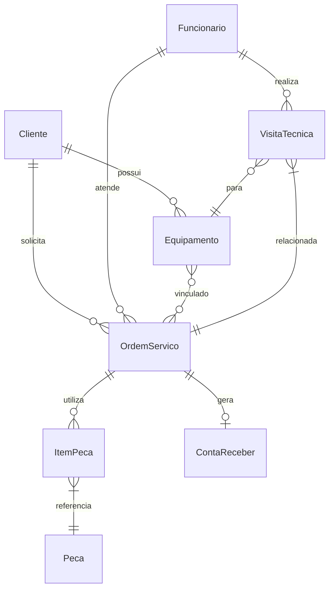

# Documento de Modelos

## Modelo Conceitual

### Diagrama de Classes

```mermaid
classDiagram
    class Cliente {
        +String cpf (PK)
        +String nome
        +String telefone
        +String email
        +String endereço
        +List<Equipamento> equipamentos
    }

    class Funcionario {
        +String cpf (PK)
        +String nome
        +String cargo
        +String telefone
        +String email
    }

    class OrdemServico {
        +String numero (PK)
        +StatusOrdem status
        +DateTime dataAbertura
        +DateTime dataEncerramento
        +String descricaoProblema
        +Float valorTotal
        +Cliente cliente
        +Funcionario tecnico
        +Equipamento equipamento
        +List<ItemPeca> pecasUtilizadas
    }

    class Equipamento {
        +Integer id (PK)
        +String tipo
        +String marca
        +String modelo
        +String numeroSerie
        +Cliente proprietario
        +List<OrdemServico> historicoServicos
    }

    class VisitaTecnica {
        +Integer id (PK)
        +Date data
        +String horario
        +String endereco
        +StatusVisita status
        +Funcionario tecnico
        +Cliente cliente
        +Equipamento equipamento
        +OrdemServico ordemServico
    }

    class ContaReceber {
        +Integer id (PK)
        +String formaPagamento
        +DateTime dataVencimento
        +OrdemServico ordemServico
    }

    class ContaPagar {
        +Integer id (PK)
        +String fornecedor
        +Float valor
        +String descricao
        +DateTime dataPagamento
    }

    class Peca {
        +Integer id (PK)
        +String nome
        +String codigoSKU
        +Float precoUnitario
    }

    class ItemPeca {
        +Integer id (PK)
        +Integer quantidade
        +Peca peca
        +OrdemServico ordemServico
    }

    enum StatusOrdem {
        Aberta
        EmAndamento
        Finalizada
        Cancelada
    }

    enum StatusVisita {
        Agendada
        EmAndamento
        Concluida
        Cancelada
    }
```

## Modelo de Dados (Entidade-Relacionamento)


