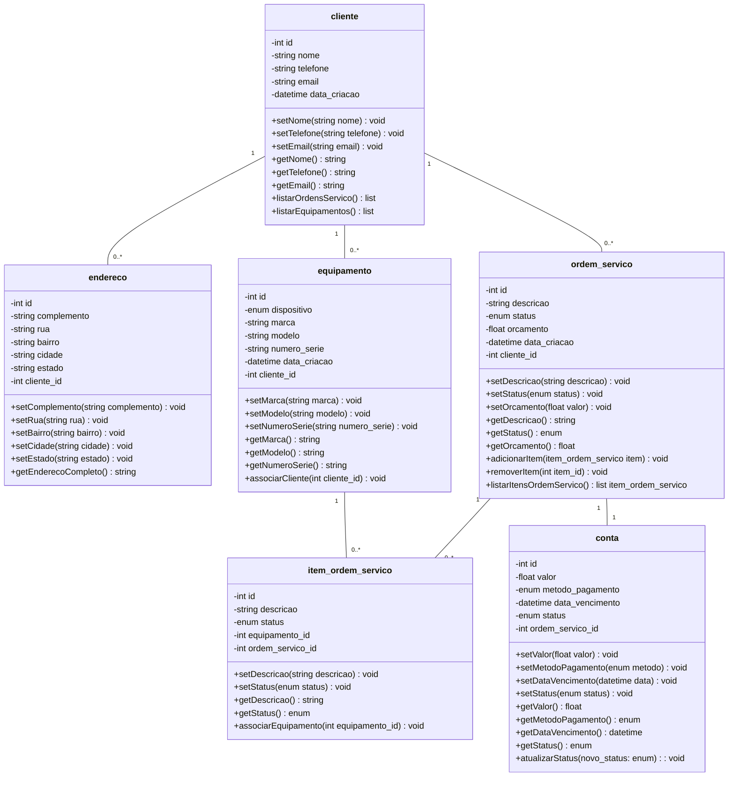

# Documento de Modelos

## Modelo Conceitual

### Diagrama de Classes e Entidade-Relacionaento

#### Descrição de enums

enum statusOS { ABERTA, EM_ANDAMENTO, FINALIZADA, CANCELADA }
enum statusItemOS { PENDENTE, EM_EXECUCAO, CONCLUIDO }
enum dispositivo { NOTEBOOK, SMARTPHONE, TABLET, DESKTOP, OUTRO }
enum metodoPagamento { DINHEIRO, CARTAO_CREDITO, CARTAO_DEBITO, PIX, BOLETO }
enum statusConta { PENDENTE, PAGO, ATRASADO, CANCELADO }

#### Descrição das entidades

| Entidade               | Descrição                                                                                                                                                                                                                                                                                                                           |
| ---------------------- | ----------------------------------------------------------------------------------------------------------------------------------------------------------------------------------------------------------------------------------------------------------------------------------------------------------------------------------- |
| **cliente**            | Representa o cliente que solicita os serviços. Possui atributos: `id`, `nome`, `telefone`, `email`, `data_criacao`. Métodos: `setNome()`, `setTelefone()`, `setEmail()`, `getNome()`, `getTelefone()`, `getEmail()`, `listarOrdensServico()`, `listarEquipamentos()`.                                                               |
| **endereco**           | Representa o endereço de um cliente. Atributos: `id`, `complemento`, `rua`, `bairro`, `cidade`, `estado`, `pessoa_id`. Métodos: `setComplemento()`, `setRua()`, `setBairro()`, `setCidade()`, `setEstado()`, `getEnderecoCompleto()`.                                                                                               |
| **equipamento**        | Equipamento do cliente que será consertado. Atributos: `id`, `dispositivo`, `marca`, `modelo`, `numero_serie`, `data_criacao`, `pessoa_id`. Métodos: `setMarca()`, `setModelo()`, `setNumeroSerie()`, `getMarca()`, `getModelo()`, `getNumeroSerie()`, `associarCliente()`.                                                         |
| **ordem_servico**      | Representa uma ordem de serviço solicitada por um cliente. Atributos: `id`, `descricao`, `status`, `orcamento`, `data_criacao`, `pessoa_id`. Métodos: `setDescricao()`, `setStatus()`, `setOrcamento()`, `getDescricao()`, `getStatus()`, `getOrcamento()`, `adicionarItem()`, `removerItem()`, `listarItensOrdemServico()`.        |
| **item_ordem_servico** | Itens da ordem de serviço, representando partes do serviço realizadas em um equipamento. Atributos: `id`, `descricao`, `status`, `equipamento_id`, `ordem_servico_id`. Métodos: `setDescricao()`, `setStatus()`, `getDescricao()`, `getStatus()`, `associarEquipamento()`.                                                          |
| **conta**              | Representa a cobrança de uma ordem de serviço. Atributos: `id`, `valor`, `metodo_pagamento`, `data_vencimento`, `status`, `ordem_servico_id`. Métodos: `setValor()`, `setMetodoPagamento()`, `setDataVencimento()`, `setStatus()`, `getValor()`, `getMetodoPagamento()`, `getDataVencimento()`, `getStatus()`, `atualizarStatus()`. |

## Dicionário de Dados

### Tabela: Cliente

| Campo        | Tipo     | Tamanho | Obrigatório? | Descrição           | Exemplo            |
| ------------ | -------- | ------- | ------------ | ------------------- | ------------------ |
| id           | SERIAL   | -       | PK           | ID único            | 1                  |
| nome         | VARCHAR  | 100     | Sim          | Nome completo       | "João da Silva"    |
| telefone     | VARCHAR  | 20      | Não          | Telefone de contato | "(11) 98765-4321"  |
| email        | VARCHAR  | 100     | Não          | E-mail válido       | "joao@email.com"   |
| data_criacao | DATETIME | -       | Sim          | Data de cadastro    | "2024-01-15 10:30" |

---

### Tabela: Endereço

| Campo       | Tipo    | Tamanho | Obrigatório? | Descrição                             | Exemplo          |
| ----------- | ------- | ------- | ------------ | ------------------------------------- | ---------------- |
| id          | SERIAL  | -       | PK           | ID único                              | 1                |
| complemento | VARCHAR | 30      | Não          | Caso precise informar algo pertinente | "AP 312"         |
| numero      | VARCHAR | 10      | Sim          | Número da casa, prédio ou condomínio  | "123A"           |
| rua         | VARCHAR | 100     | Sim          | Nome da rua                           | "Rua das Flores" |
| bairro      | VARCHAR | 50      | Sim          | Bairro                                | "Centro"         |
| cidade      | VARCHAR | 50      | Sim          | Cidade                                | "São Paulo"      |
| estado      | VARCHAR | 2       | Sim          | UF (sigla)                            | "SP"             |
| cliente_id  | INT     | -       | FK           | ID do cliente associado               | 1                |

---

### Tabela: Equipamento

| Campo        | Tipo     | Tamanho | Obrigatório? | Descrição             | Exemplo            |
| ------------ | -------- | ------- | ------------ | --------------------- | ------------------ |
| id           | SERIAL   | -       | PK           | ID único              | 1                  |
| dispositivo  | ENUM     | -       | Sim          | Tipo de dispositivo   | "Notebook"         |
| marca        | VARCHAR  | 50      | Sim          | Fabricante            | "Dell"             |
| modelo       | VARCHAR  | 50      | Sim          | Modelo específico     | "Inspiron 15"      |
| numero_serie | VARCHAR  | 50      | Sim          | Número de série único | "DEL123XYZ"        |
| data_criacao | DATETIME | -       | Sim          | Data de cadastro      | "2025-03-20 11:00" |
| cliente_id   | INT      | -       | FK           | ID do proprietário    | 1                  |

---

### Tabela: Ordem de Serviço

| Campo        | Tipo     | Tamanho | Obrigatório? | Descrição            | Exemplo            |
| ------------ | -------- | ------- | ------------ | -------------------- | ------------------ |
| id           | SERIAL   | -       | PK           | ID único             | 1                  |
| descricao    | VARCHAR  | 255     | Sim          | Descrição do serviço | "Troca de tela"    |
| status       | ENUM     | -       | Sim          | Status atual         | "Em andamento"     |
| orcamento    | FLOAT    | -       | Não          | Valor estimado       | 250.00             |
| data_criacao | DATETIME | -       | Sim          | Data de abertura     | "2025-03-20 09:15" |
| cliente_id   | INT      | -       | FK           | ID do cliente        | 1                  |

---

### Tabela: Item da Ordem de Serviço

| Campo            | Tipo    | Tamanho | Obrigatório? | Descrição              | Exemplo            |
| ---------------- | ------- | ------- | ------------ | ---------------------- | ------------------ |
| id               | SERIAL  | -       | PK           | ID único               | 1                  |
| descricao        | VARCHAR | 255     | Sim          | Detalhes do item       | "Troca de bateria" |
| status           | ENUM    | -       | Sim          | Status do item         | "Concluído"        |
| equipamento_id   | INT     | -       | FK           | ID do equipamento      | 1                  |
| ordem_servico_id | INT     | -       | FK           | ID da ordem de serviço | 1                  |

---

### Tabela: Conta

| Campo            | Tipo     | Tamanho | Obrigatório? | Descrição                  | Exemplo            |
| ---------------- | -------- | ------- | ------------ | -------------------------- | ------------------ |
| id               | SERIAL   | -       | PK           | ID único                   | 1                  |
| valor            | FLOAT    | -       | Sim          | Valor total                | 300.50             |
| metodo_pagamento | ENUM     | -       | Sim          | Forma de pagamento         | "Pix"              |
| data_vencimento  | DATETIME | -       | Sim          | Data limite para pagamento | "2025-03-20 23:59" |
| status           | ENUM     | -       | Sim          | Status da conta            | "Pendente"         |
| ordem_servico_id | INT      | -       | FK           | ID da ordem de serviço     | 1                  |

---
