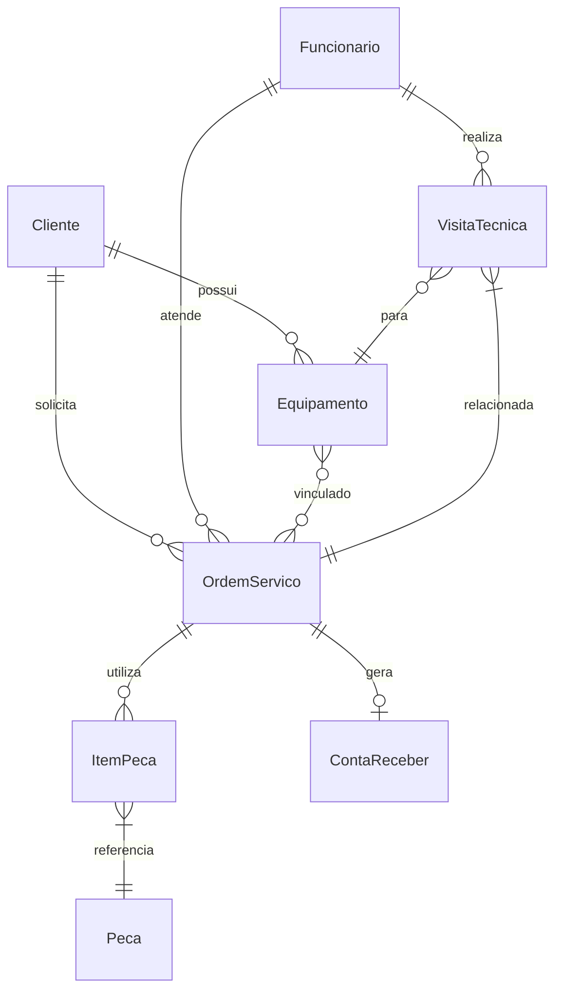

# Documento de Modelos

## Modelo Conceitual

### Diagrama de Classes

```mermaid
classDiagram
    class Cliente {
        +String cpf (PK)
        +String nome
        +String telefone
        +String email
        +String endereço
        +List<Equipamento> equipamentos
    }

    class Funcionario {
        +String cpf (PK)
        +String nome
        +String cargo
        +String telefone
        +String email
    }

    class OrdemServico {
        +String numero (PK)
        +StatusOrdem status
        +DateTime dataAbertura
        +DateTime dataEncerramento
        +String descricaoProblema
        +Float valorTotal
        +Cliente cliente
        +Funcionario tecnico
        +Equipamento equipamento
        +List<ItemPeca> pecasUtilizadas
    }

    class Equipamento {
        +Integer id (PK)
        +String tipo
        +String marca
        +String modelo
        +String numeroSerie
        +Cliente proprietario
        +List<OrdemServico> historicoServicos
    }

    class VisitaTecnica {
        +Integer id (PK)
        +Date data
        +String horario
        +String endereco
        +StatusVisita status
        +Funcionario tecnico
        +Cliente cliente
        +Equipamento equipamento
        +OrdemServico ordemServico
    }

    class ContaReceber {
        +Integer id (PK)
        +String formaPagamento
        +DateTime dataVencimento
        +OrdemServico ordemServico
    }

    class ContaPagar {
        +Integer id (PK)
        +String fornecedor
        +Float valor
        +String descricao
        +DateTime dataPagamento
    }

    class Peca {
        +Integer id (PK)
        +String nome
        +String codigoSKU
        +Float precoUnitario
    }

    class ItemPeca {
        +Integer id (PK)
        +Integer quantidade
        +Peca peca
        +OrdemServico ordemServico
    }

    enum StatusOrdem {
        Aberta
        EmAndamento
        Finalizada
        Cancelada
    }

    enum StatusVisita {
        Agendada
        EmAndamento
        Concluida
        Cancelada
    }
```

## Modelo de Dados (Entidade-Relacionamento)



# Dicionário de Dados - Sistema de Assistência Técnica

## Tabela: Cliente

| Campo         | Tipo      | Tamanho | Obrigatório? | Descrição                        | Exemplo               |
| ------------- | --------- | ------- | ------------ | -------------------------------- | --------------------- |
| cpf           | VARCHAR   | 11      | PK           | CPF do cliente (somente números) | "12345678901"         |
| nome          | VARCHAR   | 100     | Sim          | Nome completo                    | "João da Silva"       |
| telefone      | VARCHAR   | 15      | Sim          | Telefone com DDD                 | "(11) 98765-4321"     |
| email         | VARCHAR   | 100     | Não          | E-mail válido                    | "joao@email.com"      |
| endereco      | TEXT      | -       | Não          | Endereço completo                | "Rua A, 123 - SP"     |
| data_cadastro | TIMESTAMP | -       | Sim          | Data de registro (auto)          | "2024-01-15 10:30:00" |

---

## Tabela: Funcionario

| Campo    | Tipo    | Tamanho | Obrigatório? | Descrição            | Exemplo               |
| -------- | ------- | ------- | ------------ | -------------------- | --------------------- |
| cpf      | VARCHAR | 11      | PK           | CPF do funcionário   | "98765432109"         |
| nome     | VARCHAR | 100     | Sim          | Nome completo        | "Maria Oliveira"      |
| cargo    | VARCHAR | 50      | Sim          | Função               | "Técnico"             |
| telefone | VARCHAR | 15      | Sim          | Telefone corporativo | "(11) 91234-5678"     |
| email    | VARCHAR | 100     | Sim          | E-mail institucional | "tecnico@empresa.com" |

---

## Tabela: Equipamento

| Campo        | Tipo    | Tamanho | Obrigatório? | Descrição             | Exemplo       |
| ------------ | ------- | ------- | ------------ | --------------------- | ------------- |
| id           | SERIAL  | -       | PK           | ID único              | 1             |
| tipo         | VARCHAR | 50      | Sim          | Categoria             | "Notebook"    |
| marca        | VARCHAR | 50      | Sim          | Fabricante            | "Dell"        |
| modelo       | VARCHAR | 50      | Sim          | Modelo específico     | "Inspiron 15" |
| numero_serie | VARCHAR | 50      | Sim          | Número de série único | "DEL123XYZ"   |
| cliente_cpf  | VARCHAR | 11      | FK           | Dono do equipamento   | "12345678901" |

---

## Tabela: OrdemServico

| Campo              | Tipo      | Tamanho | Obrigatório? | Descrição                   | Exemplo               |
| ------------------ | --------- | ------- | ------------ | --------------------------- | --------------------- |
| numero             | VARCHAR   | 20      | PK           | Número único (OS-YYYY-NNNN) | "OS-2024-0001"        |
| status             | ENUM      | -       | Sim          | Status atual                | "EmAndamento"         |
| data_abertura      | TIMESTAMP | -       | Sim          | Data/hora de criação        | "2024-03-01 09:15:00" |
| data_encerramento  | TIMESTAMP | -       | Não          | Data/hora de conclusão      | "2024-03-05 14:30:00" |
| descricao_problema | TEXT      | -       | Sim          | Relato do cliente           | "Tela não liga"       |
| valor_total        | DECIMAL   | 10,2    | Não          | Valor do serviço            | 350.00                |
| cliente_cpf        | VARCHAR   | 11      | FK           | Cliente solicitante         | "12345678901"         |
| tecnico_cpf        | VARCHAR   | 11      | FK           | Técnico responsável         | "98765432109"         |
| equipamento_id     | INTEGER   | -       | FK           | Equipamento atendido        | 1                     |

---

## Tabela: VisitaTecnica

| Campo          | Tipo      | Tamanho | Obrigatório? | Descrição              | Exemplo               |
| -------------- | --------- | ------- | ------------ | ---------------------- | --------------------- |
| id             | SERIAL    | -       | PK           | ID único               | 1                     |
| data_hora      | TIMESTAMP | -       | Sim          | Data/hora agendada     | "2024-03-02 10:00:00" |
| endereco       | TEXT      | -       | Sim          | Local da visita        | "Av. Paulista, 1000"  |
| status         | ENUM      | -       | Sim          | Status da visita       | "Agendada"            |
| tecnico_cpf    | VARCHAR   | 11      | FK           | Técnico designado      | "98765432109"         |
| equipamento_id | INTEGER   | -       | FK           | Equipamento (opcional) | 1                     |
| os_numero      | VARCHAR   | 20      | FK           | OS relacionada         | "OS-2024-0001"        |

---

## Tabela: Peca

| Campo          | Tipo    | Tamanho | Obrigatório? | Descrição         | Exemplo         |
| -------------- | ------- | ------- | ------------ | ----------------- | --------------- |
| id             | SERIAL  | -       | PK           | ID único          | 1               |
| codigo_sku     | VARCHAR | 50      | Sim          | Código do estoque | "TELA-DELL-15"  |
| nome           | VARCHAR | 100     | Sim          | Nome descritivo   | "Tela LCD 15''" |
| preco_unitario | DECIMAL | 10,2    | Sim          | Preço atual       | 250.00          |

---

## Tabela: ItemPeca

| Campo      | Tipo    | Tamanho | Obrigatório? | Descrição           | Exemplo        |
| ---------- | ------- | ------- | ------------ | ------------------- | -------------- |
| id         | SERIAL  | -       | PK           | ID único            | 1              |
| quantidade | INTEGER | -       | Sim          | Qtd. utilizada (≥1) | 2              |
| peca_id    | INTEGER | -       | FK           | Peça utilizada      | 1              |
| os_numero  | VARCHAR | 20      | FK           | OS vinculada        | "OS-2024-0001" |

---

## Tabela: ContaReceber

| Campo           | Tipo    | Tamanho | Obrigatório? | Descrição           | Exemplo        |
| --------------- | ------- | ------- | ------------ | ------------------- | -------------- |
| id              | SERIAL  | -       | PK           | ID único            | 1              |
| forma_pagamento | VARCHAR | 50      | Sim          | Método de pagamento | "PIX"          |
| data_vencimento | DATE    | -       | Sim          | Data limite         | "2024-03-10"   |
| valor           | DECIMAL | 10,2    | Sim          | Valor a receber     | 350.00         |
| os_numero       | VARCHAR | 20      | FK           | OS geradora         | "OS-2024-0001" |

---

## Tabela: ContaPagar

| Campo          | Tipo    | Tamanho | Obrigatório? | Descrição          | Exemplo           |
| -------------- | ------- | ------- | ------------ | ------------------ | ----------------- |
| id             | SERIAL  | -       | PK           | ID único           | 1                 |
| fornecedor     | VARCHAR | 100     | Sim          | Nome do fornecedor | "Peças Tech Ltda" |
| valor          | DECIMAL | 10,2    | Sim          | Valor a pagar      | 150.00            |
| descricao      | TEXT    | -       | Não          | Detalhes           | "Compra de telas" |
| data_pagamento | DATE    | -       | Não          | Data de quitação   | "2024-03-03"      |
