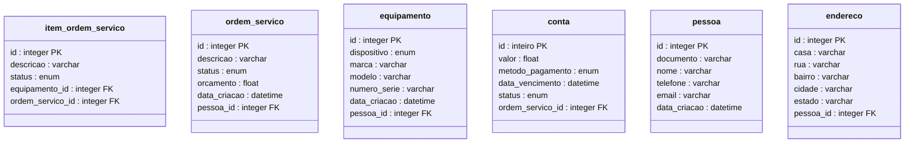
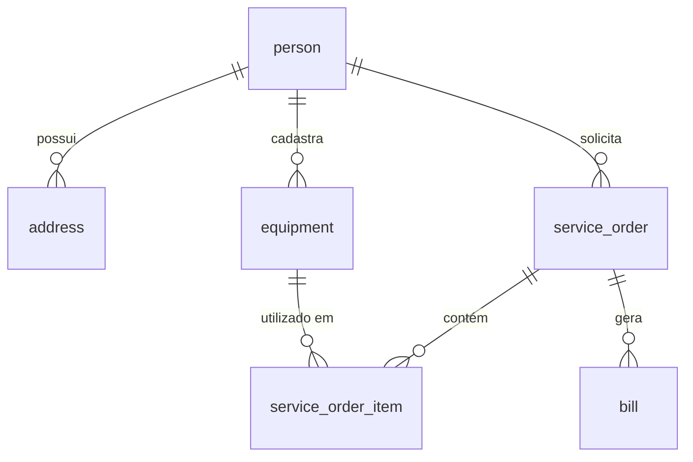

# Documento de Modelos

## Modelo Conceitual

### Diagrama de Classes

```mermaid
classDiagram
    class item_ordem_servico {
        id : integer PK
        descricao : varchar
        status : enum
        equipamento_id : integer FK
        ordem_servico_id : integer FK
    }

    class ordem_servico {
        id : integer PK
        descricao : varchar
        status : enum
        orcamento : float
        data_criacao : datetime
        pessoa_id : integer FK
    }

    class equipamento {
        id : integer PK
        dispositivo : enum
        marca : varchar
        modelo : varchar
        numero_serie : varchar
        data_criacao : datetime
        pessoa_id : integer FK
    }

    class conta {
        id : inteiro PK
        valor : float
        metodo_pagamento : enum
        data_vencimento : datetime
        status : enum
        ordem_servico_id : integer FK
    }

    class pessoa {
        id : integer PK
        documento : varchar
        nome : varchar
        telefone : varchar
        email : varchar
        data_criacao : datetime
    }

    class endereco {
        id : integer PK
        casa : varchar
        rua : varchar
        bairro : varchar
        cidade : varchar
        estado : varchar
        pessoa_id : integer FK
    }
```

## Modelo de Dados (Entidade-Relacionamento)

```mermaid
erDiagram
    service_order ||--o{ service_order_item : "contém"
    equipment ||--o{ service_order_item : "utilizado em"
    person ||--o{ address : "possui"
    person ||--o{ equipment : "cadastra"
    person ||--o{ service_order : "solicita"
    service_order ||--o{ bill : "gera"
```
